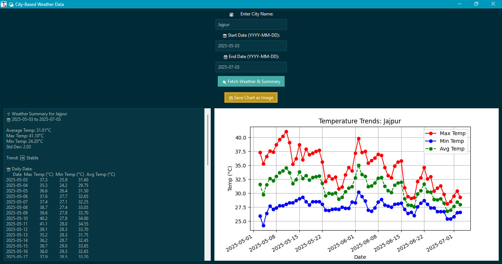

# 🌤️ Python Weather Data Summarizer

A modern Python GUI application to fetch, analyze, and visualize weather data for any city worldwide. Built with `ttkbootstrap` for a sleek user interface and integrated with OpenCage (geolocation) and Open-Meteo (weather data) APIs. Visualizations powered by `matplotlib`.

## 📌 Features

- 🌍 Get accurate coordinates using OpenCage Geocoding API
- ⛅ Fetch real-time weather data (temperature, humidity, wind speed, etc.) from Open-Meteo
- 📊 Visualize temperature and humidity trends with interactive charts
- 🧑‍💻 Beautiful GUI using `ttkbootstrap`
- 💾 Save fetched weather data to a CSV file
- 🛠️ Responsive error handling and validation

---

## 🧪 Technologies Used

| Technology         | Purpose                                                        |
|--------------------|----------------------------------------------------------------|
| Python             | Core programming language                                      |
| `ttkbootstrap`     | Stylish modern GUI framework for Tkinter                       |
| `matplotlib`       | Data visualization and chart plotting                          |
| `pandas`           | Data handling and CSV export                                   |
| `requests`         | HTTP requests to interact with external APIs                   |
| `dotenv`           | Manage environment variables and API keys securely            |
| **OpenCage API**   | Convert city names to latitude and longitude (Geocoding API)   |
| **Open-Meteo API** | Fetch real-time weather data (temperature, humidity, etc.)     |


## 📸 Screenshots




---

## 🚀 Getting Started

### 1. Clone the Repository

```bash
git clone https://github.com/omprakash0224/python-weather-data-summarizer.git
cd python-weather-data-summarizer
```

### 2. Install Requirements

Make sure you have **Python 3.9 or later** installed. Then install the required packages:

```bash
pip install -r requirements.txt
```

### 3. Setup `.env` file

Create a `.env` file in the root directory and add your API key:

```bash
OPENCAGE_API_KEY=your_opencage_api_key
```

### Run the application

```bash
python app.py
```
